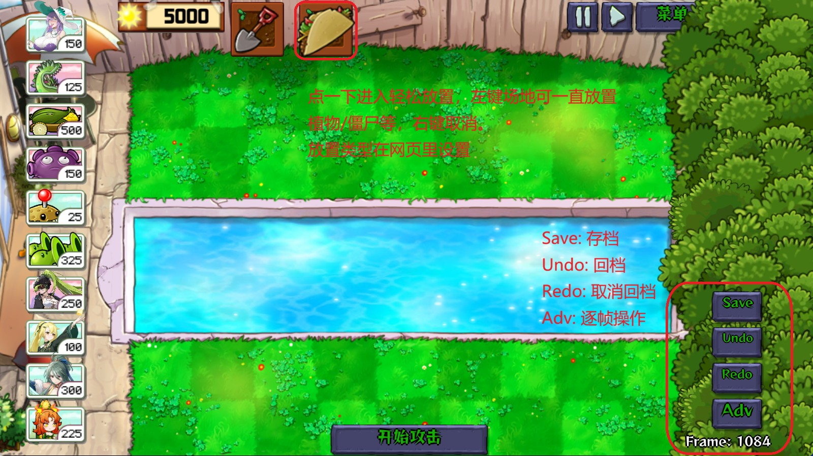

# PGvZ-TAS

植物娘大战僵尸自动脚本框架、修改器及 TAS 工具。by yuchenxi2000

> [English version](README_EN.md)

> 植物娘大战僵尸（PlantGirls vs. Zombies，PGvZ）是植物大战僵尸的社区改版，游戏作者[庄不纯](https://space.bilibili.com/20530305)

## 快速开始

**PC**：运行 `cp-cheat-mods.bat` 自动安装，或手动将 `pgvz/`、`pgvztool/`、`gui/`、`cheat-gui.py` 复制到 mods 目录。启动游戏，浏览器打开 `http://localhost:58080`。

**安卓**：将以上文件复制到 mods 目录，启动游戏，浏览器打开 `http://localhost:58080`。（你可能需要一个文件管理器来复制文件，比如MT管理器）

mods 目录位置：

| 平台 | 路径 |
|---|---|
| PC | `C:\Users\{用户名}\AppData\Roaming\ZBC\PlantGirlsVsZombies\mods` |
| 安卓 | `/storage/emulated/0/Android/data/net.pvz.pgvz.zbcteam/files/mods` |

详细安装步骤和故障排查见 [docs/install.md](docs/install.md)。

## 修改器功能、TAS 工具使用

- **常用修改**：免费用卡、随意种植、植物/僵尸无敌、暂停出怪等几十项开关
- **场地放置**：直接在网页里选择植物/僵尸/物品类型，点击按钮放置到场地
- **轻松放置**：勾选"轻松放置"，选择放置模式（植物/僵尸/物品等），进入关卡后点击铲子右边的 Taco 图标激活，左键场地放置，右键退出。选择传送门模式可移动传送门位置
- **TAS 工具**：在"常用修改"中勾选"启用 TAS"后，右下角出现四个按钮——Save 存档、Undo 回到上一个存档点（live 状态下会先自动保存当前位置）、Redo 前进到下一个存档点、Adv 运行一帧后暂停。右下角还有帧计数器。利用这些功能可以精确控制操作时机，实现类似模拟器 TAS 的效果
- **自定义快捷键**：可重新绑定选择种子包、使用铲子、暂停游戏等按键，已适配常见非英文输入法，详见 [docs/keybinds.md](docs/keybinds.md)

下面是图片教程，轻松放置和 TAS 工具使用方法：

## 脚本编写

`pgvz` 模块提供完整的脚本框架，包括选卡、时间控制、炮管理、脚本调度等。脚本用生成器函数编写，注册到 `script_manager` 后随游戏帧自动运行。

脚本编写与使用详见 [docs/scripting.md](docs/scripting.md)。

## 开源协议

MIT License

## 致谢

布阵码数据来自 PvZToolkit（感谢 lmintlcx）。
